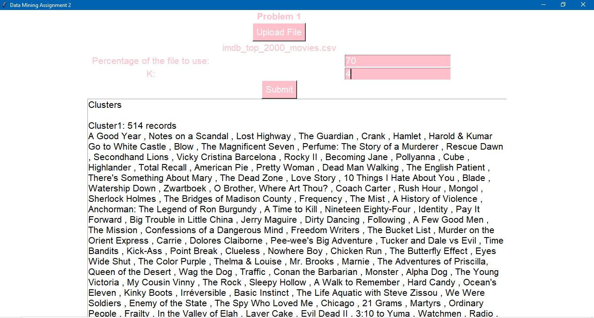

# K-means-Clustering-Algorithm-with-Tkinter-GUI

This repository contains Python implementation of K-means algorithm with outliers detection. 
It also includes removing outliers and performing reclustering. 

This plot shows the clusters before and after removing outliers. Since the data is one-dimensional, I added an offset to prevent it from being displayed as a single horizontal line.
Red points are the centroids of the clusters.
